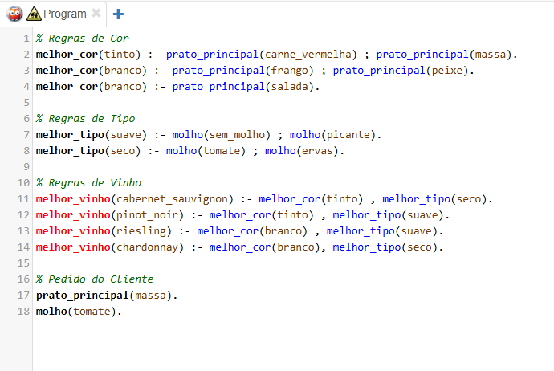
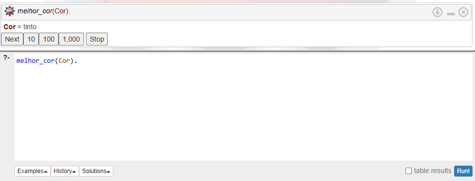
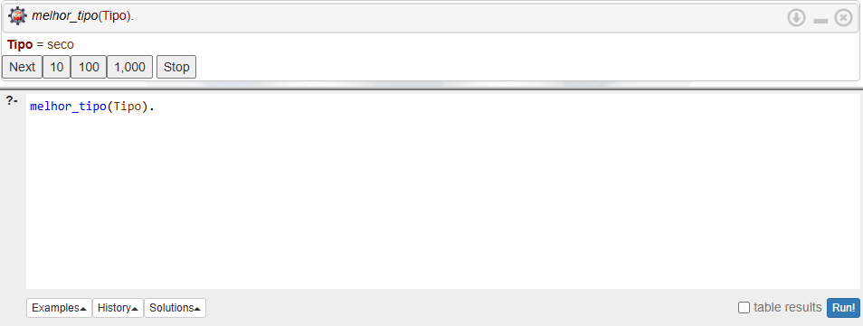
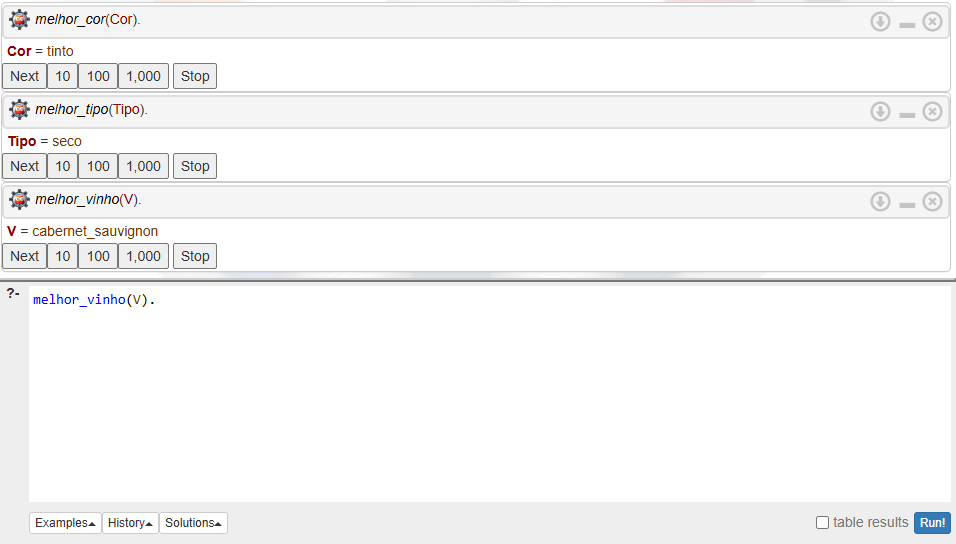
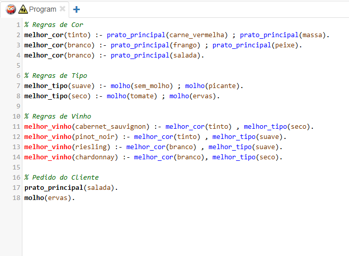
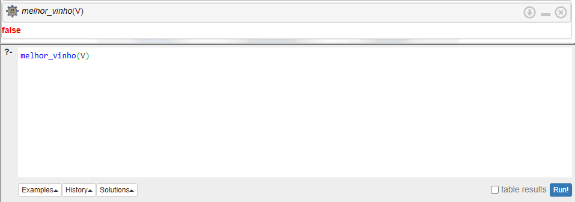

# prolog_2
Atividade 7 - Lab Guiado Prolog (2)

## Codigo

### Parte 3
Passo 3.1: Vamos perguntar ao Prolog qual é a melhor cor para a Mesa 1.   
PERGUNTA 1: Qual foi a cor recomendada?. Tinto  

### Passo 3.2: Vamos perguntar o tipo de vinho.  
PERGUNTA 2: Qual foi o tipo recomendado?. Seco  

### Passo 3.3 (A Pergunta de Ouro): Vamos pedir para a máquina cruzar tudo e dar a sugestão final.  
PERGUNTA 3: Qual foi o vinho exato que o sistema recomendou?  
V = cabernet_sauvignon  

### PERGUNTA 4 Explique com as suas próprias palavras como o Prolog chegou sozinho a essa conclusão matemática (como ele encadeou as regras). 
Resposta: O Prolog analisou os fatos do cliente: prato_principal(massa). molho(tomate)., Como o prato era massa, a regra definiu a cor como tinto, o molho era tomate, a regra definiu o tipo como seco.
Em seguida, o Prolog procurou um vinho que fosse ao mesmo tempo tinto e seco. A regra do cabernet_sauvignon dizia exatamente isso.

## Codigo2
 

## PARTE 4: MISSÕES INDEPENDENTES

### Desafio 1: O Cliente Vegano
O restaurante agora serve Salada. A regra é: "Se o prato for salada, a melhor cor é branco." Além disso, criaram um molho de Ervas Finais. A regra é: "Se o molho for de ervas, o vinho deve ser seco."
Missão: Adicione essas regras, troque o pedido do cliente para prato_principal(salada). e molho(ervas). e rode a consulta melhor_vinho(V). Qual vinho o sistema recomendou para o vegano?
V = False

### Desafio 2: O Novo Vinho
A adega acaba de receber garrafas de Chardonnay. O Sommelier determinou que esse vinho é recomendado apenas quando a melhor cor for Branco e o melhor tipo for Seco.
Missão: Crie a regra do Chardonnay no seu código. Teste alterando os fatos do cliente para que a máquina recomende exatamente esse vinho. Escreva a regra que você criou:melhor_vinho(chardonnay) :- melhor_cor(branco), melhor_tipo(seco).

### Desafio 3: O Mistério da Falha (Backtracking em mente)
Apague (ou comente com %) o fato molho(...) do pedido do seu cliente. Deixe apenas o prato_principal. Agora, faça a consulta melhor_vinho(V).

Missão: O Prolog respondeu false. Por que o sistema falhou ao invés de recomendar qualquer vinho aleatório da cor certa? O que aconteceu com o Subobjetivo de tipo de vinho durante a execução?  
Resposta: O sistema falhou porque ele precisava descobrir tanto a cor quanto o tipo do vinho para recomendar um vinho específico. Quando o fato do molho foi removido, o Prolog conseguiu encontrar a cor do vinho, mas não conseguiu descobrir o tipo (suave ou seco).  Então o subobjetivo: melhor_tipo(...), falhou. Como todas as regras de melhor_vinho dependem de cor E tipo ao mesmo tempo, nenhuma delas pôde ser completada, e o resultado foi: false. O Prolog não escolhe respostas aleatórias, ele só retorna algo quando todas as condições das regras são verdadeiras.
